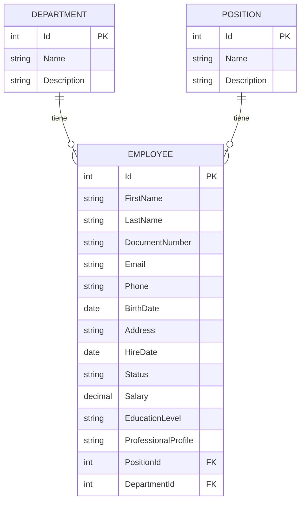
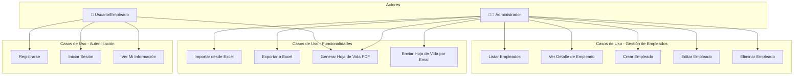
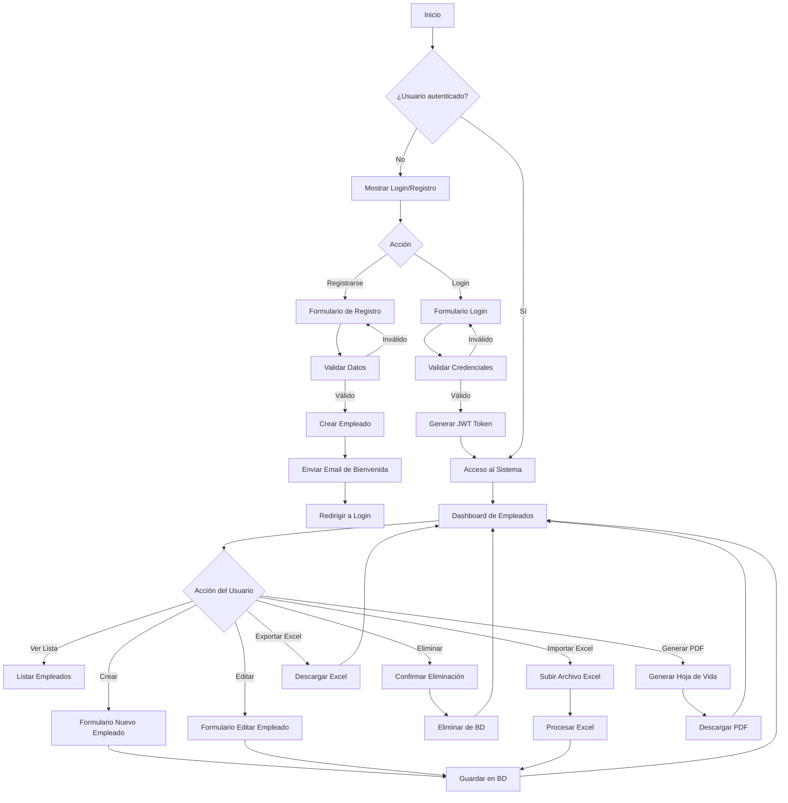
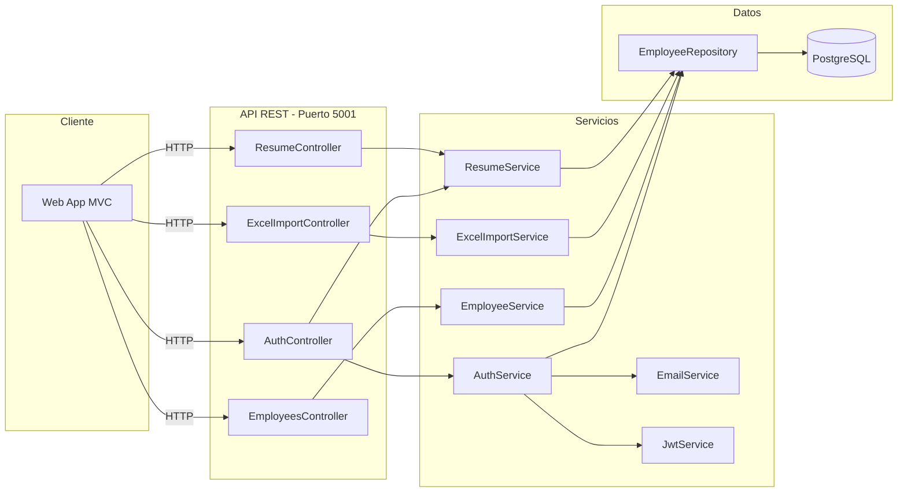

# TalentoPlus - Sistema de Gestión de Empleados

Sistema completo para la gestión de empleados de TalentoPlus S.A.S., compuesto por una API REST y una aplicación web MVC.

## 🔗 Repositorio

[Link del repositorio](https://github.com/TU_USUARIO/TalentoPlus)

> ⚠️ Reemplaza el link con la URL real de tu repositorio.

---

## 📊 Diagrama Entidad-Relación



---

## 👤 Diagrama de Casos de Uso



---

## 🔄 Diagrama de Flujo - Flujo Principal de la Aplicación



---

## 🔄 Diagrama de Flujo - API REST



---

## 🚀 Pasos para correr la solución

### Prerrequisitos

- [Docker](https://docs.docker.com/get-docker/) instalado
- [Docker Compose](https://docs.docker.com/compose/install/) instalado

### Ejecución

1. **Clonar el repositorio:**
   ```bash
   git clone https://github.com/TU_USUARIO/TalentoPlus.git
   cd TalentoPlus
   ```

2. **Crear el archivo de variables de entorno:**
   ```bash
   cp .env.example .env
   ```
   > Edita el archivo `.env` con las credenciales proporcionadas (ver sección de configuración).

3. **Levantar los contenedores:**
   ```bash
   docker-compose up --build -d
   ```

4. **Verificar que los contenedores estén corriendo:**
   ```bash
   docker-compose ps
   ```

5. **Acceder a la aplicación:**
   - **Web App:** http://localhost:5000
   - **API (Swagger):** http://localhost:5001/swagger

### Comandos útiles

```bash
# Ver logs en tiempo real
docker-compose logs -f

# Detener los contenedores
docker-compose down

# Reiniciar los contenedores
docker-compose restart
```

---

## ⚙️ Configuración de Variables de Entorno

Crear un archivo `.env` en la raíz del proyecto con las siguientes variables:

```env
# Base de datos
DB_HOST=<host_de_la_base_de_datos>
DB_PORT=5432
DB_NAME=<nombre_de_la_base_de_datos>
DB_USER=<usuario>
DB_PASSWORD=<contraseña>

# JWT
JWT_SECRET=<clave_secreta_jwt>
JWT_ISSUER=TalentoPlusAPI
JWT_AUDIENCE=TalentoPlusClients
JWT_EXPIRATION_HOURS=24

# SMTP (para envío de correos)
SMTP_HOST=smtp.gmail.com
SMTP_PORT=587
SMTP_USER=<correo>
SMTP_PASSWORD=<contraseña_de_aplicación>
SMTP_FROM_NAME=Web app - TalentoPlus
SMTP_FROM_EMAIL=<correo>
```

---

## 🔑 Credenciales de Acceso

### Base de Datos (PostgreSQL)

| Campo    | Valor                     |
|----------|---------------------------|
| Host     | 157.90.251.124            |
| Puerto   | 5432                      |
| Database | JuanDavid_Prueba          |
| Usuario  | riwi_user                 |
| Password | J9YoXTAy77bVPxwMtArRHfXDC |

### Aplicación Web

| Campo    | Valor                 |
|----------|-----------------------|
| URL      | http://localhost:5000 |

### API

| Campo   | Valor                         |
|---------|-------------------------------|
| URL     | http://localhost:5001         |
| Swagger | http://localhost:5001/swagger |

---

## 🏗️ Arquitectura

```
TalentoPlus/
├── docker-compose.yml          # Orquestación de contenedores
├── .env                        # Variables de entorno (no versionado)
├── .env.example                # Plantilla de variables
├── TalentoPlusAPI/             # API REST (.NET 8)
│   ├── Controllers/
│   │   ├── AuthController.cs
│   │   ├── EmployeesController.cs
│   │   ├── ExcelImportController.cs
│   │   └── ResumeController.cs
│   ├── Services/
│   ├── Repositories/
│   ├── Models/
│   ├── DTOs/
│   └── Dockerfile
└── TalentoPlusWeb/             # Aplicación Web MVC (.NET 8)
    ├── Controllers/
    ├── Views/
    ├── Services/
    └── Dockerfile
```

---

## 📋 Endpoints de la API

| Método | Endpoint                      | Descripción                    |
|--------|-------------------------------|--------------------------------|
| GET    | /api/employees                | Listar todos los empleados     |
| GET    | /api/employees/{id}           | Obtener empleado por ID        |
| POST   | /api/employees                | Crear nuevo empleado           |
| PUT    | /api/employees/{id}           | Actualizar empleado            |
| DELETE | /api/employees/{id}           | Eliminar empleado              |
| POST   | /api/auth/register            | Autoregistro de empleado       |
| POST   | /api/auth/login               | Iniciar sesión                 |
| GET    | /api/auth/departments         | Listar departamentos           |
| POST   | /api/excelimport/upload       | Importar empleados desde Excel |
| GET    | /api/resume/employee/{id}     | Generar hoja de vida PDF       |

---

## 👤 Autor

- **Nombre:** Juan David
- **Proyecto:** Prueba Técnica TalentoPlus