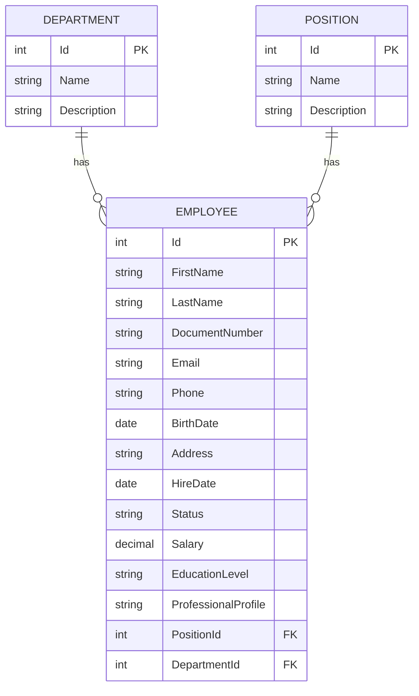
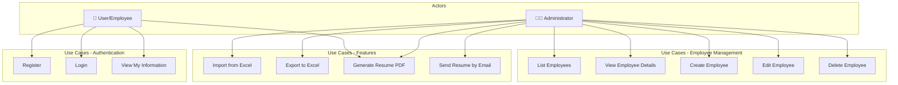
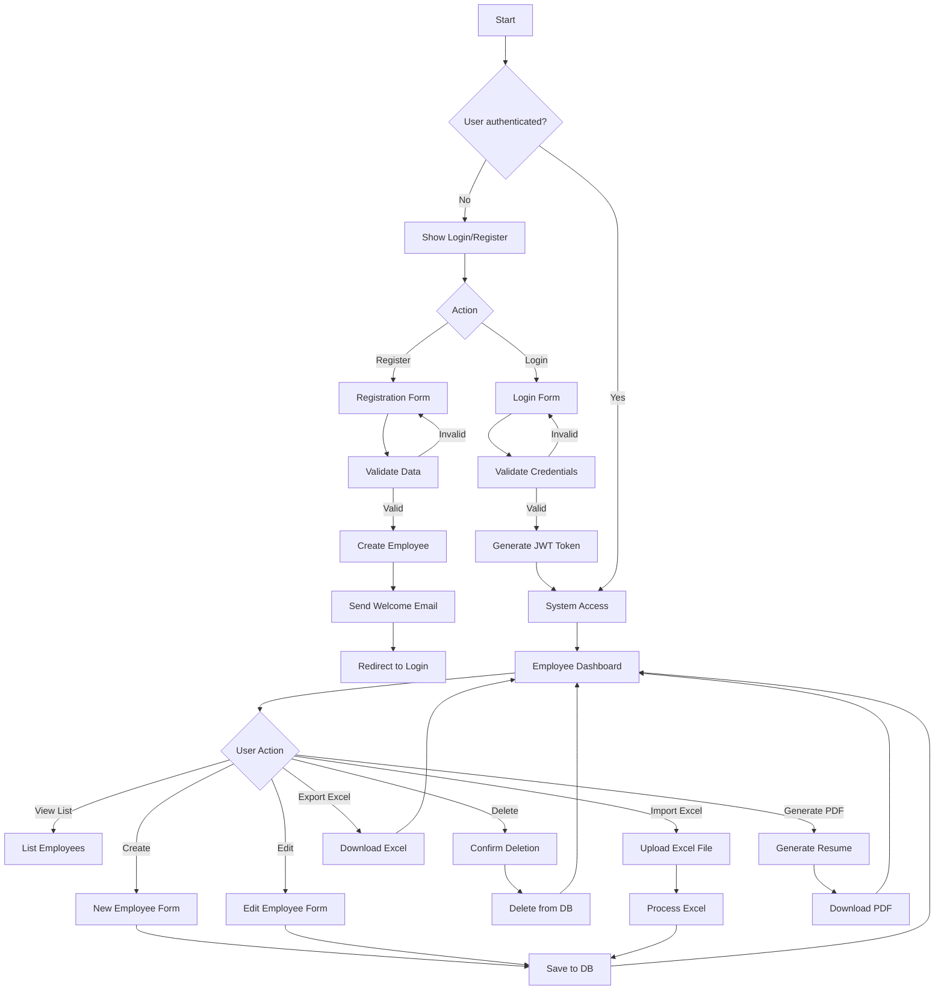
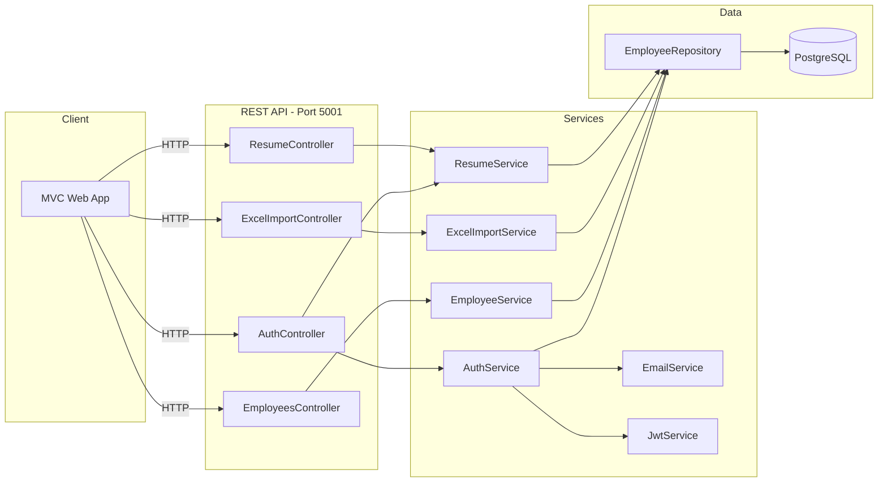

# TalentoPlus - Employee Management System

Complete system for employee management at TalentoPlus S.A.S., composed of a REST API and an MVC web application.

## 🔗 Repository

[Repository Link](https://github.com/JuanDavidBarr/TalentoPlus)

---

## 📊 Entity-Relationship Diagram



---

## 👤 Use Case Diagram



---

## 🔄 Flow Diagram - Main Application Flow



---

## 🔄 Flow Diagram - REST API



---

## 🚀 Steps to Run the Solution

### Prerequisites

- [Docker](https://docs.docker.com/get-docker/) installed
- [Docker Compose](https://docs.docker.com/compose/install/) installed

### Execution

1. **Clone the repository:**
   ```bash
   git clone https://github.com/JuanDavidBarr/TalentoPlus.git
   cd TalentoPlus
   ```

2. **Create the environment variables file:**
   ```bash
   cp .env.example .env
   ```
   > Edit the `.env` file with the provided credentials (see configuration section).

3. **Start the containers:**
   ```bash
   docker-compose up --build -d
   ```

4. **Verify that containers are running:**
   ```bash
   docker-compose ps
   ```

5. **Access the application:**
   - **Web App:** http://localhost:5000
   - **API (Swagger):** http://localhost:5001/swagger

### Useful Commands

```bash
# View logs in real time
docker-compose logs -f

# Stop the containers
docker-compose down

# Restart the containers
docker-compose restart
```

---

## ⚙️ Environment Variables Configuration

Create a `.env` file in the project root with the following variables:

```env
# Database
DB_HOST=<database_host>
DB_PORT=5432
DB_NAME=<database_name>
DB_USER=<username>
DB_PASSWORD=<password>

# JWT
JWT_SECRET=<jwt_secret_key>
JWT_ISSUER=TalentoPlusAPI
JWT_AUDIENCE=TalentoPlusClients
JWT_EXPIRATION_HOURS=24

# SMTP (for sending emails)
SMTP_HOST=smtp.gmail.com
SMTP_PORT=587
SMTP_USER=<email>
SMTP_PASSWORD=<app_password>
SMTP_FROM_NAME=Web app - TalentoPlus
SMTP_FROM_EMAIL=<email>
```

---

## 🔑 Access Credentials

### Database (PostgreSQL)

| Field    | Value                     |
|----------|---------------------------|
| Host     | 157.90.251.124            |
| Port     | 5432                      |
| Database | JuanDavid_Prueba          |
| Username | riwi_user                 |
| Password | J9YoXTAy77bVPxwMtArRHfXDC |

### Web Application

| Field | Value                 |
|-------|-----------------------|
| URL   | http://localhost:5000 |

### API

| Field   | Value                         |
|---------|-------------------------------|
| URL     | http://localhost:5001         |
| Swagger | http://localhost:5001/swagger |

---

## 🏗️ Architecture

```
TalentoPlus/
├── docker-compose.yml          # Container orchestration
├── .env                        # Environment variables (not versioned)
├── .env.example                # Variables template
├── TalentoPlusAPI/             # REST API (.NET 8)
│   ├── Controllers/
│   │   ├── AuthController.cs
│   │   ├── EmployeesController.cs
│   │   ├── ExcelImportController.cs
│   │   └── ResumeController.cs
│   ├── Services/
│   ├── Repositories/
│   ├── Models/
│   ├── DTOs/
│   └── Dockerfile
└── TalentoPlusWeb/             # MVC Web Application (.NET 8)
    ├── Controllers/
    ├── Views/
    ├── Services/
    └── Dockerfile
```

---

## 📋 API Endpoints

| Method | Endpoint                  | Description                |
|--------|---------------------------|----------------------------|
| GET    | /api/employees            | List all employees         |
| GET    | /api/employees/{id}       | Get employee by ID         |
| POST   | /api/employees            | Create new employee        |
| PUT    | /api/employees/{id}       | Update employee            |
| DELETE | /api/employees/{id}       | Delete employee            |
| POST   | /api/auth/register        | Employee self-registration |
| POST   | /api/auth/login           | Login                      |
| GET    | /api/auth/departments     | List departments           |
| POST   | /api/excelimport/upload   | Import employees from Excel|
| GET    | /api/resume/employee/{id} | Generate resume PDF        |

---

## 👤 Author

- **Name:** Juan David
- **Project:** TalentoPlus Technical Test
